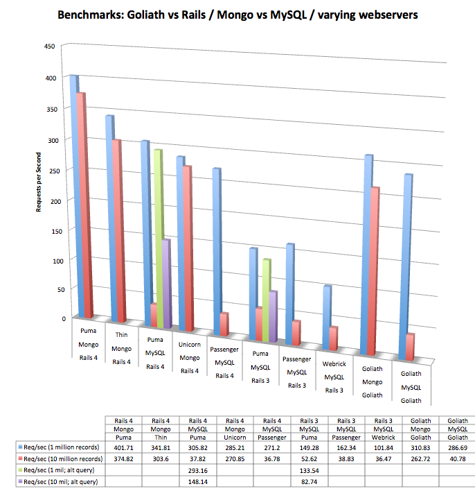

4 API Benchmarks
================

Four different app architectures for benchmarking concurrent API designs where the general goal is to randomly select a single record (per HTTP request) from a large data set:

* Rails 4 + MySQL 
* Rails 4 + MongoDB 
* Goliath + MySQL
* Goliath + MongoDB

Usage
-----

Each mini-app contains either a `config/database.yml` (Rails/MySQL), `config/mongoid.yml` (Rails/Mongo), `db/mongoid.yml` (Goliath/Mongo), or a `db/config.yml` (Goliath/MySQL) for initializing database connections. Alter these as necessary.

You might notice that I ended up sharing the config for MySQL between two apps; and I did the same for MongoDB. This was just because I'm lazy and didn't want to recreate a 1,000,000 record database for each of the 4 benchmark apps. Creating only 2 (one in sql, one in mongo) was simpler.

You will likely need to run `rake db:migrate` for setting up your first MySQL database. For MongoDB, it's Mongo, so it will auto-create the db when you first run a query against it.

Setting up the Test Corpus
--------------------------

You want lots of rows to benchmark against. Easiest way: use console and manually run the `Item.generate_tons` command. It defaults to 1 million, but you can pass a different value.

NOTE: you only have to do this once for each of the two database types (mysql vs mongo) if you are sharing them the way I did.

Caveat (IMPORTANT)
------

This is NOT a "boil the ocean" benchmark. I have a specific purpose here, with a specific app architecture: I'm benchmarking an app where we have a *LARGE* dataset and we want to have an API where we can request *1* record *AT RANDOM* per HTTP request. The big assumption is that we pre-create this dataset and it's largely canned. That is, we have a contiguous sequence of IDs (in the MySQL case) or a relatively uniform segmenting method (in the Mongo case).

_If you want to just know, generally, if Rails4 is better than Goliath, or MySQL is better than MongoDB, then you're asking a question I'm not intending to answer here. I'd argue that you need to consider your use-cases and app architecture before that question is even relevant._

My Results
----------

Obviously, your own results may vary, but here's what I got from running these 4 benchmarks.

First, my specs:

* Everything was run on an iMac desktop, 3.1 GHz Intel Core i5 with 4 GB memory.
* MySQL server v.5.5.25a
* MongoDB v.2.2.3
* Ruby 2.0.0-p0
* Benchmarking using ApacheBench v2.3
* Rails is on 4.0.0 and is set to run in multithreaded mode by default now, so no changes needed from stock Rails 4 configuration.

Benchmark request: `ab -n 1000 -c 20 http://lvh.me:9000/v1/items/random`
(with the appropriate port and without the `v1` in the case of the Rails apps)

* Concurrency Level: __20__
* Number of Requests: __1000__



### Discussion of MySQL Performance at 10mil Records

So, when we bump up our table/collection to 10 million records, things start to get hairy. MySQL appears to fall on its face. After some investigation, though, I figured out what was going on here. It's really more of a result of the random() method I wrote for ActiveRecord. Even with an index on `id`, doing a `WHERE id >= 123456` is quite a bit slower in SQL than doing `WHERE id=123456`. The former is to protect us from holes in our id sequence (usually when something has been deleted). If we're assuming a canned set and we know there will never be holes, the latter query is far better and puts Rails4/MySQL right back up there with Rails4/Mongo... almost exactly the same requests/sec. If we assume a canned set with _some_ holes (but not too many), throwing that query inside a `while result.nil?` actually outperforms the `>=` query. Of course, this performance will degrade as more holes in the id sequence pollute our table, but if we're assuming that won't happen, this method protects us from the occasional mistake so we don't accidentally return a nil result. If you're building a more traditional app where this table is constantly changing, then you'll have to look at other approaches, or just deal with the fact that it's not going to be super-fast on every query...

### Raw Data
<table>
  <caption>1 Million Records</caption>
  <thead>
    <tr>
      <th>Webserver</th>
      <th>Framework</th>
      <th>Database</th>
      <th>Requests per Second (mean)</th>
    </tr>
  </thead>
  <tbody>
      <tr>
        <td>Puma</td>
        <td>Rails 4.0.0</td>
        <td>MongoDB<sup>1</sup></td>
        <td><strong style="color: magenta;">401.71</strong></td>
      </tr>
      <tr>
        <td>Thin</td>
        <td>Rails 4.0.0</td>
        <td>MongoDB<sup>1</sup></td>
        <td><strong style="color: magenta;">341.81</strong></td>
      </tr>      
      <tr>
        <td>Goliath internal</td>
        <td>Goliath 1.0.2</td>
        <td>MongoDB<sup>2</sup></td>
        <td><strong style="color: magenta;">310.83</strong></td>
      </tr>      
      <tr>
        <td>Puma</td>
        <td>Rails 4.0.0</td>
        <td>MySQL</td>
        <td><strong style="color: magenta;">305.82</strong></td>
      </tr>     
      <tr>
        <td>Goliath internal</td>
        <td>Goliath 1.0.2</td>
        <td>MySQL</td>
        <td><strong style="color: magenta;">286.69</strong></td>
      </tr>
      <tr>
        <td>Unicorn-Rails</td>
        <td>Rails 4.0.0</td>
        <td>MongoDB<sup>1</sup></td>
        <td><strong style="color: magenta;">285.21</strong></td>
      </tr>               
      <tr>
        <td>Passenger 4.0.5 Standalone</td>
        <td>Rails 4.0.0</td>
        <td>MySQL</td>
        <td><strong style="color: magenta;">271.20</strong></td>
      </tr>            
      <tr>
        <td>Passenger 4.0.5 Standalone</td>
        <td>Rails 3.2.13</td>
        <td>MySQL</td>
        <td><strong style="color: magenta;">162.34</strong></td>
      </tr>         
      <tr>
        <td>Puma</td>
        <td>Rails 3.2.13</td>
        <td>MySQL</td>
        <td><strong style="color: magenta;">149.28</strong></td>
      </tr>         
      <tr>
        <td>Webrick</td>
        <td>Rails 3.2.13</td>
        <td>MySQL</td>
        <td><strong style="color: magenta;">101.84</strong></td>
      </tr>
  </tbody>
</table>

<table>
  <caption>10 Million Records</caption>
  <thead>
    <tr>
      <th>Webserver</th>
      <th>Framework</th>
      <th>Database</th>
      <th>Requests per Second (mean)</th>
    </tr>
  </thead>
  <tbody>
      <tr>
        <td>Puma</td>
        <td>Rails 4.0.0</td>
        <td>MongoDB<sup>1</sup></td>
        <td><strong style="color: magenta;">374.82</strong></td>
      </tr>
      <tr>
        <td>Thin</td>
        <td>Rails 4.0.0</td>
        <td>MongoDB<sup>1</sup></td>
        <td><strong style="color: magenta;">303.60</strong></td>
      </tr>      
      <tr>
        <td>Unicorn-Rails</td>
        <td>Rails 4.0.0</td>
        <td>MongoDB<sup>1</sup></td>
        <td><strong style="color: magenta;">270.85</strong></td>
      </tr>  
      <tr>
        <td>Goliath internal</td>
        <td>Goliath 1.0.2</td>
        <td>MongoDB<sup>2</sup></td>
        <td><strong style="color: magenta;">262.72</strong></td>
      </tr>     
      <tr>
        <td>Goliath internal</td>
        <td>Goliath 1.0.2</td>
        <td>MySQL</td>
        <td><strong style="color: magenta;">40.78</strong></td>
      </tr>  
      <tr>
        <td>Puma</td>
        <td>Rails 4.0.0</td>
        <td>MySQL</td>
        <td><strong style="color: magenta;">37.82</strong></td>
      </tr>                
      <tr>
        <td>Passenger 4.0.5 Standalone</td>
        <td>Rails 4.0.0</td>
        <td>MySQL</td>
        <td><strong style="color: magenta;">36.78</strong></td>
      </tr>
      <tr>
        <td>Passenger 4.0.5 Standalone</td>
        <td>Rails 3.2.13</td>
        <td>MySQL</td>
        <td><strong style="color: magenta;">38.83</strong></td>
      </tr>         
      <tr>
        <td>Puma</td>
        <td>Rails 3.2.13</td>
        <td>MySQL</td>
        <td><strong style="color: magenta;">52.62</strong></td>
      </tr>         
      <tr>
        <td>Webrick</td>
        <td>Rails 3.2.13</td>
        <td>MySQL</td>
        <td><strong style="color: magenta;">36.47</strong></td>
      </tr>

  </tbody>
</table>

<p>
  <sup>1</sup> This is using Mongoid ODM fully for the queries. Apparently Mongoid 4.0 (for Rails 4) properly handles Rails multithreading, because in this setup it was clear that my requests were being handled concurrently.
</p>
<p>
  <sup>2</sup> The Mongoid ODM does not (yet) work with EM-Synchrony in a non-blocking manner. So, to make this work with Goliath's concurrency, I had to drop down to the Moped driver level and manually code the <code>Item.random()</code> query instead of using the Mongoid methods.
</p>


### My Random Methods ###

I initially wrote two `Item.random()` methods, one for MySQL/ActiveRecord and one for MongoDB/Mongoid. After realizing some issues with the Mongoid ODM and concurrency via EventMachine, I had to write a third method for testing against MongoDB using the Moped lower-level wire protocol interface, since Mongoid wasn't going to cut it in that setup. 

In the case of the MongoDB `random()`, I added a `randomizer` field to every document. This field contains an integer from a defined range, evenly distributed across the documents and indexed, as a way of segmenting the 1,000,000 doc collection so picking a random one actually involves first picking a random segment and then randomly choosing one record in that segment. Even with two Mongo queries, this is much, much faster than trying to use `skip()` across all one million records. This is very close to what the 10gen guys actually recommend you do for random MongoDB record selection.

In the case of the MySQL/ActiveRecord queries, I had a similar problem: it's inadvisable to randomly sort a MySQL query on a large table. So, again, I used a trick of randomly picking a row id from within the known min..max range of all ids in the table.

So here they are, for your amusement:

__Rails4/MongoDB/Mongoid__
```ruby
  def random      
    # in the off case where a segment doesn't have a full set and we pick an offset 
    # that results in a nil response, we just run another query. This is slower than
    # my previous method, in theory, but faster if we assume our db has contiguous sets
    # more often than it does not.
    result = nil
    while result.nil?
      r, i = rand(RANDOM_SEGMENT_SIZE), rand(RANDOM_SEGMENT_SIZE)
      result = where(randomizer: r).skip(i).first
    end
    result
  end
```
__Goliath/MongoDB/Moped__
```ruby
  # attempt at a reasonably-performant way to randomly pick a single record
  # without resorting to a nasty full scan of a millon records
  # CAVEAT EMPTOR: 
  #   with a lot of gaps in the randomizer sequence, this becomes less uniformly random
  def random
    coll = self.to_s.tableize
    r = rand(RANDOM_SEGMENT_SIZE)
    # not using mongoid for this; mongoid cannot yet support EM concurrency
    set_size = $moped[coll].find(r: r).count
    h = $moped[coll].find(r: r).skip(rand(RANDOM_SEGMENT_SIZE)).limit(-1).first
    Item.new(h)
  end
```

__MySQL/ActiveRecord__
```ruby
  # attempt at a reasonably-performant way to randomly pick a single record
  # without resorting to a nasty full table scan using ORDER RANDOM
  # CAVEAT EMPTOR: 
  #   with a lot of gaps in the ID sequence, this becomes less uniformly random
  def random
    if minimum = self.minimum(:id)
      where("id >= ?", ::Random.new.rand(minimum..self.maximum(:id))).first
    else
      nil
    end
  end
```
